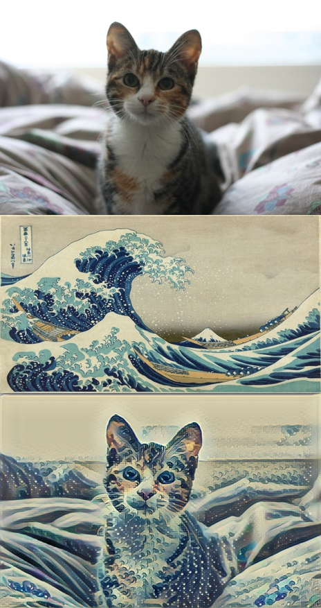

# Udacity深度学习纳米学位课程

## 课程1
- Sampyl:[用Python编写的MCMC Samplers](http://matatat.org/sampyl/index.html)
- Siraj Raval大神的个人[主站](http://www.sirajraval.com/)
- Python2.7和3.x版本的重要[区别](http://www.techug.com/post/the-difference-of-python2-and-python3.html#future)

## 课程2
- 快速风格迁移，根据著名化作的风格进行训练，将风格迁移到其他图片上，甚至视频上。
- 课程2采用的是 Hokusai 的 The Great Wave Off Kanagawa对猫咪进行风格迁移。

### 课堂2-成果

